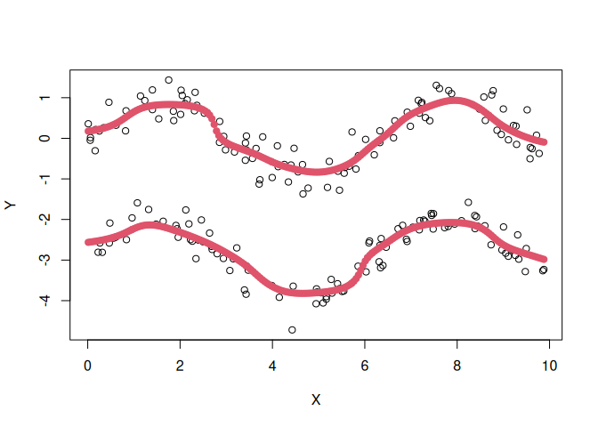
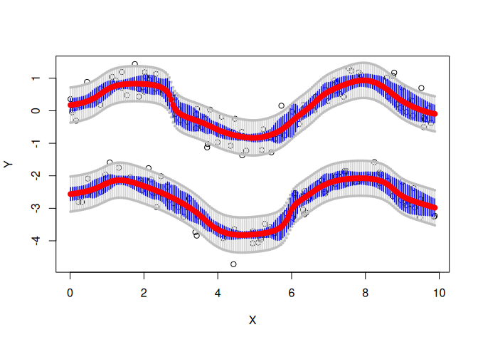
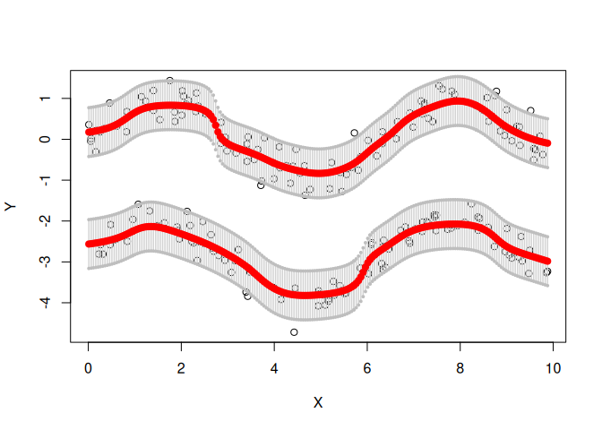

<!-- README.md is generated from README.Rmd. Please edit that file -->

<!-- The goal of MRpms is to ... -->

## Installation

You can install the development version of MRpms from
[GitHub](https://github.com/) with:

    # install.packages("remotes")
    remotes::install_github("Brigantium/MRpms")

## About this package

The main goal of this package is to preforms modal regression over data
sets with, as to date, unidimensional covariable. That is: to detect
modes of the response variable $Y$’s distribution conditional to
$X = x$, where $X$ is the covaribale.

<!-- incluir aquí varias de las referencias o, incluso, nuestro propio paper -->

The basic function included in this package is `PMS`, which preforms the
estimaton over a given matrix sample:

``` r
library(MRpms)
data(twosines) # a data set with two sines shifted by 3 and a normal error of sd = 0.3 
modas <- PMS(twosines, h1 = 0.5, h2 = 0.5) 
plot(twosines) 
plot(modas, pch = 19, col = 2)
```



In addition, is possible to compute confidence regions too —blue are
pointwise intervals, grey is an uniform confidence region, both to
conditional modes—:

``` r

invisible(ConfPMS(twosines, modas = modas, h1 = 0.5, h2 = 0.5, B = 10))
```



And, last, with `PredPMS` an uniform prediction region is computed for
the response variable $Y$ —in grey—:

``` r

invisible(PredPMS(muestra = twosines, h1 = 0.5, h2 = 0.5))
```



<!-- ``` r -->

<!-- # install.packages("pak") -->

<!-- pak::pak("Brigantium/MRpms") -->

<!-- ``` -->

<!-- ## Example -->

<!-- This is a basic example which shows you how to solve a common problem: -->

<!-- ```{r example} -->

<!-- library(MRpms) -->

<!-- ## basic example code -->

<!-- ``` -->

<!-- What is special about using `README.Rmd` instead of just `README.md`? You can include R chunks like so: -->

<!-- ```{r cars} -->

<!-- summary(cars) -->

<!-- ``` -->

<!-- You'll still need to render `README.Rmd` regularly, to keep `README.md` up-to-date. `devtools::build_readme()` is handy for this. -->

<!-- You can also embed plots, for example: -->

<!-- ```{r pressure, echo = FALSE} -->

<!-- plot(pressure) -->

<!-- ``` -->

<!-- In that case, don't forget to commit and push the resulting figure files, so they display on GitHub and CRAN. -->
